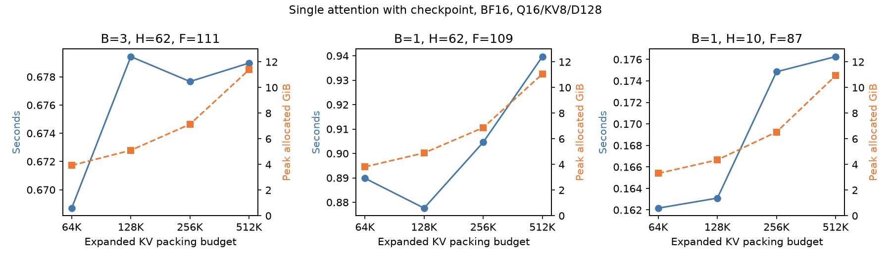
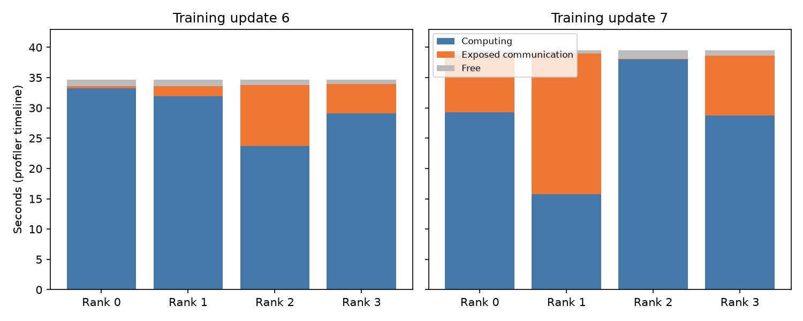

# TND / BSA 实验总结

结论：选择 TND 路线。相对 Dense，时间和显存均明显改善；相对 BSA，吞吐更高、部署限制更少，但显存基本持平。

## 实验条件

Cosmos3-Edge、BF16、Ascend 910B3、`cosmos-framework-py312`、`egosuite_demo_v1`；480p、最长 30 秒分片。主对照使用 4 卡，运行 15 步，前 5 步预热，统计后 10 步。时间取每步最慢卡后求平均，显存取各卡最大已分配峰值（allocated）。除 SAC 实验外采用完整梯度检查点，EMA 关闭。

Dense/TND 使用原始分辨率桶（736×544），BSA/TND 使用相同的对齐桶（768×512）。只在同一行内比较，不跨实验计算加速比。

## 核心实验

| 实验                                | 现象                                       | 核心问题                                         | 方法                                                                       | 效果与结论                                                                                                                             |
| ----------------------------------- | ------------------------------------------ | ------------------------------------------------ | -------------------------------------------------------------------------- | -------------------------------------------------------------------------------------------------------------------------------------- |
| [Dense → TND](#dense-tnd)           | Dense 训练慢、显存高                       | 显式二维掩码开销大，需保留原注意力语义           | 按合法可见 KV 分组，使用无掩码 TND；反向逐组重建 KV，FP32 累加共享梯度     | **82.39 → 35.34 秒/步（耗时 −57.11%）**；显存 **48.20 → 38.69 GiB（−9.50 GiB）**                                                       |
| [Dense → BSA](#dense-bsa)           | Dense 未利用块级稀疏性，计算和显存开销高   | BSA 需要对齐块边界，并保证 UND 尾块不泄漏        | 使用 64-token 块级 mask、重排 KV；在相同对齐桶下比较 Dense/BSA             | 四卡 **78.26 → 36.09 秒/步（−53.88%）**，显存 **46.88 → 38.45 GiB（−8.43 GiB）**；八卡耗时 **−53.10%**                                 |
| [BSA → TND](#bsa-tnd)               | BSA 依赖自定义算子及 64-token 对齐         | 形状约束和部署成本高；不同分辨率结果不能直接比较 | 固定相同分辨率、样本、block/history，进行配对测试                          | **36.10 → 32.10 秒/步（耗时 −11.08%，吞吐 +12.46%）**；显存 **38.45 → 38.54 GiB**，基本持平                                            |
| [history 扫描](#history-scan)       | history 增大后明显变慢，显存变化较小       | 历史范围与同时驻留的 KV 数量不是一回事           | 扫描 block=1/4、history=1–96；整网固定 block=1，对比 history=1/64          | 整网 **14.49 → 35.34 秒/步（2.44×）**；显存仅 **+59 MiB**。固定视频规模下，计算增长明显，显存近似平稳                                  |
| [KV 打包预算](#kv-budget)           | 增大预算可减少算子调用                     | 更少调用是否一定更快                             | 固定注意力语义，扫描 64K/128K/256K/512K；整网复核 64K/128K                 | 整网 **35.4215 / 35.4255 秒/步**，差异无实际意义；大预算增加单层显存且无稳定提速。**保留 128K**                                        |
| [TND + SAC](#tnd-sac)               | 完整梯度检查点会重算注意力前向             | 能否减少重计算且保持梯度正确                     | 缓存 FA 输出，核对原生调用次数、输出和梯度，再做整网对照                   | **35.43 → 32.16 秒/步（耗时 −9.20%）**；显存 **38.69 → 52.68 GiB（+13.98 GiB，+36.14%）**。用显存换速度                                |
| [梯度验证](#gradient-validation)    | 初版低精度累加未通过容差；训练存在梯度波动 | 区分累加错误、数值误差与训练波动                 | 改用 FP32 累加；36 组对照 FP64、原生自动求导和 Dense；捕获真实训练张量回放 | 已测范围未发现 TND 反向错误。真实回放 dQ/dK/dV 相对 L2 差 **0.370% / 0.060% / 0.046%**，范数比接近 1，无 NaN/Inf                       |
| [多卡性能分析](#multi-rank-profile) | 快卡计算少，却等待慢卡完成                 | 不同视频长度、block/history 导致负载不均衡       | 采集四卡相同步骤的计算、通信和算子时间线                                   | 同一步慢卡计算 **38.04s**、快卡 **15.72s**，整步约 **39.53s**；慢卡 FA 占计算核累计时间 **52–55%**。后续优先排查负载均衡和通信关键路径 |

## Dense → TND：如何实现、如何验证

**实现方法：** 将每个样本的 clean/noisy 流按时间块分组，每组只取合法 KV，执行一次完整 softmax；不同逻辑组可打包到一次 TND 调用，但互不可见。保留 UND 原有注意力路径，不截断 clean KV 的梯度。

| 查询组        | 可见 KV                                | 保持不变的语义             |
| ------------- | -------------------------------------- | -------------------------- |
| 当前 clean 块 | UND + 前 H 个 clean 块 + 当前 clean 块 | clean 历史窗口与块内可见性 |
| 当前 noisy 块 | UND + 前 H 个 clean 块 + 当前 noisy 块 | 不可见其他 noisy 块        |

**反向方法：** 前向保存原始 Q/K/V、输出及原生 FA 统计量；反向按 chunk 重新 gather KV，调用原生 FA grad。重复使用的 KV 梯度在 FP32 中累加，再转换回 BF16，避免保存所有展开 KV 带来的显存增长。

### 中间验证：先确认语义与反向，再测速度

| 阶段                | 对照方法                                                                      | 结果                                                     |
| ------------------- | ----------------------------------------------------------------------------- | -------------------------------------------------------- |
| 可见关系与 CPU 精度 | 将分组索引展开，与 dense mask 对照；覆盖混合长度、首尾块、MHA/GQA、checkpoint | 24 组 CPU float64 输出与 Q/K/V 梯度检查通过              |
| 初版 NPU 反向       | 直接 gather 后使用低精度梯度累加，与 Dense 对照                               | 有元素未通过预设容差，未放宽阈值                         |
| 修正后 NPU 反向     | 改为共享 KV 梯度 FP32 累加，仍使用原容差                                      | 24 组检查通过；BF16 容差为 atol=rtol=0.008               |
| 长序列验证          | 96 latent 帧、17×23 空间 token、UND=67、B=1/H=15；普通及 checkpoint 两条路径  | 输出最大绝对差 0.001953，梯度最大绝对差 0.007813，均通过 |

### 中间性能：单层 attention 前后向

使用上述长序列几何和固定输入，预热 3 次、测量 10 次。计时包括 gather、原生反向和梯度累加，不包括 VAE、投影、FFN、FSDP 和优化器；准备时间单列，不计入前后向合计。

| 实现  | 掩码/索引准备（秒） | 前向（秒） | 反向（秒） | 前后向合计（秒） | 峰值 allocated（GiB） |
| ----- | ------------------- | ---------- | ---------- | ---------------- | --------------------- |
| Dense | 3.4032              | 0.7283     | 1.3181     | 2.0464           | 9.2372                |
| TND   | 0.2753              | 0.0804     | 0.2123     | 0.2928           | 4.9914                |

单层前后向约 **6.99× 加速**，但整网还有其他计算及通信，最终整网加速为 **2.33×**。该对照同时改变了掩码表示和注意力执行方式，不能把全部收益归因于“省掉 mask 张量”。

### 最终验证：四卡整网

只替换 GEN attention 后端；保持原始分辨率桶、数据、seed=42、B=1–4/H=1–64 的采样配置以及完整梯度检查点一致。四个 rank 全部 15 步的样本、帧区间及 packing 几何核对一致，两个运行均正常完成。

| 指标                       | Dense   | TND     | 变化          |
| -------------------------- | ------- | ------- | ------------- |
| 平均秒/步                  | 82.3876 | 35.3370 | 耗时 −57.11%  |
| 有效 noisy vision token/秒 | 1916.38 | 4468.01 | 吞吐 +133.15% |
| 峰值 allocated（GiB/卡）   | 48.1968 | 38.6932 | −9.5036 GiB   |
| 峰值 reserved（GiB/卡）    | 59.9043 | 58.6934 | −1.2109 GiB   |

reserved 包含分配器缓存，因此其降幅小于 allocated；9.50GiB 节省不能直接解释为 npu-smi 占用下降同样大小。

## Dense → BSA：如何实现、如何验证

将逐 token 的二维 mask 替换为 64-token 块级 mask，使用自定义 Ascend BSA64 前后向算子跳过不可见块。KV 从 `[UND, clean, noisy]` 重排为 `[clean, noisy, UND]`，保持 Q 和输出顺序；UND 尾块使用真实长度，不加入可见 padding key。

### 适配与精度验证

| 检查项      | 方法                                                                            | 结果                                                                              |
| ----------- | ------------------------------------------------------------------------------- | --------------------------------------------------------------------------------- |
| 块边界      | 同一视觉块内必须具有相同 stream/block 标识；不支持的形状直接报错                | 不通过扩大可见范围来迁就对齐                                                      |
| 分辨率对齐  | Dense/BSA 同时使用 768×512 桶，实际每 latent 帧 384 个空间 token                | 排除更换分辨率造成的比较偏差                                                      |
| 24 组小形状 | UND=1/17/63/64/65/129，覆盖 MHA/GQA、两种 block/history；展开块 mask 对照 Dense | mask 逐位一致；输出最大绝对差 ≤0.001953，梯度 ≤0.007813，全部通过 atol=rtol=0.008 |
| 长序列      | 视觉形状 `(17,32,48)`、UND=67、B=2/H=8、Q/KV heads=24/8、D=128                  | mask、输出和梯度检查通过；验证非整块 UND 尾部无 padding 泄漏                      |

### 中间检查：长序列单次调用

以下包含 BSA 重排，但**未预热、仅测一次**，只证明大形状可运行，不作为稳态加速结论。

| 后端  | 前向秒  | 反向秒  |
| ----- | ------- | ------- |
| Dense | 0.52458 | 0.75934 |
| BSA64 | 0.16550 | 0.39857 |

### 最终验证：四卡、八卡整网

相同对齐桶、480p/最长 30s 分片、BF16、完整 checkpoint；每组 15 步，统计后 10 步。同卡数两后端的输入核对通过，四组均正常完成。不同卡数的数据分配不同，不作为扩展效率对照。

| 卡数 | 后端  | 平均秒/步 | allocated GiB/卡 | reserved GiB/卡 | 相对同卡数 Dense                   |
| ---- | ----- | --------- | ---------------- | --------------- | ---------------------------------- |
| 4    | Dense | 78.257    | 46.879           | 59.889          | 基线                               |
| 4    | BSA64 | 36.091    | 38.448           | 56.676          | 耗时 −53.88%，allocated −8.432 GiB |
| 8    | Dense | 75.846    | 44.024           | 59.475          | 基线                               |
| 8    | BSA64 | 35.574    | 35.598           | 57.342          | 耗时 −53.10%，allocated −8.426 GiB |

BSA 相对 Dense 的时间与显存收益明确，但依赖自定义库和块对齐。这是早期 Dense/BSA 配对实验；后续 BSA/TND 使用独立运行，不能将不同实验的耗时直接混算。表中显存保留三位小数，差值按原始数据计算。

## BSA → TND：如何做公平对照

**对照方法：** BSA 通过块级 mask 跳过不可见块，当前适配要求视觉边界按 64 token 对齐，并将 KV 重排为 `[clean, noisy, UND]`；TND 用逻辑组直接表达相同可见关系。为了只比较后端，两者统一使用 BSA 对齐桶，不拿原始桶 TND 的 35.34s 与 BSA 直接计算收益。

| 控制项     | 两种后端采用的相同条件                                                                           |
| ---------- | ------------------------------------------------------------------------------------------------ |
| 分辨率     | 768×512，每 latent 帧 16×24=384 个空间 token                                                     |
| 数据与几何 | 相同样本、帧区间、block/history；全部 15 步 packing 核对一致                                     |
| 训练配置   | 同一组四卡、BF16、完整梯度检查点、EMA 关闭、seed=42                                              |
| 测量       | 顺序运行 BSA/TND，各 15 步，统计后 10 步；关闭 profiler                                          |
| 精度       | BSA 对 Dense 的 24 组小形状检查通过；BSA/TND 四组长几何输出和 Q/K/V 梯度检查通过 atol=rtol=0.008 |

### 中间性能：不同 block/history 的单层对照

固定 96 latent 帧、16×24 空间 token、UND=67、Q/KV heads=24/8、head_dim=128。每种后端预热 3 次、测量 10 次；时间包括重排/gather、前后向和梯度累加，索引准备另计。这里使用测试头数配置，单层倍率不直接代表整网倍率。

| block | history | BSA 前后向（秒） | TND 前后向（秒） | TND 加速比 | BSA allocated（GiB） | TND allocated（GiB） |
| ----- | ------- | ---------------- | ---------------- | ---------- | -------------------- | -------------------- |
| 1     | 1       | 0.1190           | 0.0399           | 2.984×     | 5.3748               | 6.0679               |
| 1     | 15      | 0.3040           | 0.2534           | 1.199×     | 5.3748               | 4.9026               |
| 1     | 64      | 0.7328           | 0.7080           | 1.035×     | 5.3748               | 4.8780               |
| 4     | 22      | 0.8378           | 0.5075           | 1.651×     | 5.3748               | 5.1054               |

TND 的收益依赖几何：短 history 加速较大，但 H=1 单层峰值显存反而更高；B=1/H=64 时前后向接近，不能宣称所有情况都明显胜过 BSA。该长历史下索引准备时间为 BSA 0.0314s、TND 0.7997s，每个 batch 准备一次，不能按模型层数重复相乘。按 `2×前向+反向` 估算完整检查点成本，BSA/TND 为 0.8872/0.8964s，基本持平；这只是估算，不是额外实测。

### 最终验证：四卡整网

| 指标                       | BSA     | TND     | 变化                  |
| -------------------------- | ------- | ------- | --------------------- |
| 平均秒/步                  | 36.1031 | 32.1035 | 耗时 −11.08%          |
| 有效 noisy vision token/秒 | 4351.27 | 4893.37 | 吞吐 +12.46%          |
| 峰值 allocated（GiB/卡）   | 38.4478 | 38.5416 | +0.0938 GiB，基本持平 |
| 峰值 reserved（GiB/卡）    | 56.6758 | 57.8848 | +1.2090 GiB           |

TND 在 10 个测量步中有 8 步更快，仍有 2 步较慢。该结果来自一次配对短程实验，不能外推为所有任务的固定收益。选择 TND 的依据是本次吞吐提升、无需自定义 BSA 库以及更宽的形状支持，**不是相对 BSA 更省显存**。

## history 扫描：完整实验列表

固定输入为 96 个 latent 帧、每帧 16×24 空间 token、UND=67，BF16、Q/KV heads=24/8、head_dim=128、KV 预算 131072；仅改变 block/history，观察计算时间和显存变化。每组预热 2 次、测量 5 次。history 单位是 block。

### 单层 attention：16 组

时间为普通前向＋反向，不含索引准备；显存为单进程峰值 allocated，包含输入、输出及梯度。checkpoint 列是另一次启用 attention 级重计算的显存测量，不代表整网显存。

| block | history | chunk 数 | 前后向峰值 GiB | checkpoint 峰值 GiB | 前后向秒 | 索引 MiB |
| ----- | ------- | -------- | -------------- | ------------------- | -------- | -------- |
| 1     | 1       | 2        | 6.0679         | 6.4898              | 0.0405   | 1.78     |
| 1     | 2       | 2        | 5.6533         | 6.0759              | 0.0595   | 2.33     |
| 1     | 4       | 3        | 5.2615         | 5.6834              | 0.0884   | 3.41     |
| 1     | 8       | 5        | 5.0587         | 5.4803              | 0.1453   | 5.51     |
| 1     | 16      | 10       | 4.8696         | 5.2915              | 0.2714   | 9.43     |
| 1     | 32      | 16       | 4.8645         | 5.2864              | 0.4685   | 16.13    |
| 1     | 64      | 26       | 4.8785         | 5.3004              | 0.7098   | 25.04    |
| 1     | 96      | 31       | 4.8817         | 5.3039              | 0.7862   | 27.94    |
| 4     | 1       | 2        | 6.2531         | 6.6750              | 0.0884   | 1.70     |
| 4     | 2       | 2        | 5.7587         | 6.1806              | 0.1211   | 2.22     |
| 4     | 4       | 3        | 5.3237         | 5.7456              | 0.1902   | 3.19     |
| 4     | 8       | 5        | 5.1876         | 5.6095              | 0.3057   | 4.85     |
| 4     | 16      | 7        | 5.1057         | 5.5276              | 0.4609   | 7.06     |
| 4     | 32      | 8        | 5.1067         | 5.5275              | 0.5120   | 7.76     |
| 4     | 64      | 8        | 5.1067         | 5.5275              | 0.5117   | 7.76     |
| 4     | 96      | 8        | 5.1067         | 5.5275              | 0.5125   | 7.76     |

图：history 对单层显存与计算时间的影响；左图虚线为 checkpoint 显存，右图为普通前后向耗时。

B=1 时，history 增大使计算时间持续上升，显存先降后近似平稳；B=4 时共有 25 个时间块，H≥24 已覆盖全部历史，因此 H=32/64/96 的计划相同。同一个 H 下，B=4 的历史跨度更大，不能当成等上下文对比。

### 四卡整网：两组端点

使用同一批真实视频、480p 对齐桶、最长 30s 分片，固定 B=1；完整梯度检查点，运行 8 步、统计后 5 步。时间取最慢卡，显存取各卡最大峰值。

| block | history | 平均秒/步 | allocated GiB/卡 | reserved GiB/卡 |
| ----- | ------- | --------- | ---------------- | --------------- |
| 1     | 1       | 14.4916   | 37.4398          | 56.2988         |
| 1     | 64      | 35.3402   | 37.4974          | 56.3789         |

H=1 → 64：耗时变为 **2.44×**，allocated 仅增加 **59.03 MiB（0.154%）**。整网只测了这两个端点；未测中间 history 或固定 B=4 的整网结果。

## KV 打包预算：完整实验列表

保持输入和注意力可见关系不变，仅调整每次 TND 调用的展开 KV 预算，检查“减少调用次数”能否提速。使用三种真实训练几何、固定随机 BF16 Q/K/V（非真实激活），Q/KV heads=16/8、head_dim=128；每组预热 3 次、测量 10 次，时间取中位数。

| 几何 | latent 帧数 | 每帧空间 token | block | history |
| ---- | ----------- | -------------- | ----- | ------- |
| A    | 111         | 17×23          | 3     | 62      |
| B    | 109         | 17×23          | 1     | 62      |
| C    | 87          | 17×23          | 1     | 10      |

### 单层 attention：12 组

下表统一展示开启 checkpoint 的结果，时间包含前后向和重计算；每格依次为 **秒 / 峰值 allocated GiB / chunk 数**。K 按 1024 计算，128K=131072。

| 预算 | A                       | B                       | C                       |
| ---- | ----------------------- | ----------------------- | ----------------------- |
| 64K  | 0.6687s / 3.923GiB / 35 | 0.8898s / 3.814GiB / 74 | 0.1622s / 3.301GiB / 12 |
| 128K | 0.6794s / 5.102GiB / 14 | 0.8776s / 4.894GiB / 32 | 0.1631s / 4.351GiB / 6  |
| 256K | 0.6777s / 7.133GiB / 7  | 0.9046s / 6.874GiB / 16 | 0.1749s / 6.531GiB / 3  |
| 512K | 0.6790s / 11.386GiB / 4 | 0.9397s / 11.050GiB / 8 | 0.1763s / 10.930GiB / 2 |

图：蓝线为 checkpoint 前后向耗时，橙线为峰值 allocated；左右纵轴单位不同。

增大预算减少了 chunk 数，但没有稳定提速，单层峰值显存明显增加。12 个几何/预算组合均验证了逻辑组一致，并通过普通及 checkpoint 路径的输出、Q/K/V 梯度对照。

### 四卡整网：两组预算对照

原始 480p 桶、最长 30s 分片、完整梯度检查点、EMA 关闭；固定相同输入与 block/history，运行 15 步，前 5 步预热，统计后 10 步。

| 预算 | 平均秒/步 | 峰值 allocated GiB | 峰值 reserved GiB |
| ---- | --------- | ------------------ | ----------------- |
| 128K | 35.4255   | 38.6932            | 57.6172           |
| 64K  | 35.4215   | 38.6812            | 58.7207           |

64K 相对 128K 的耗时仅减少 **0.011%**，allocated 仅减少约 **12.2 MiB**，没有可确认的实用收益，保留 **128K**。256K/512K 未做整网测试；64K 组测量完整，但外层退出码为 143，未视为正常退出。

## TND + SAC：完整实验列表

保存 FA 输出及统计量，避免反向时再次计算 FA 前向；其他未匹配算子仍重算。使用生产 checkpoint wrapper，SAC 匹配规则为 `fusion_attention`。

### 小网络：8 组模式检查

两层网络，BF16、Q/KV heads=16/8、head_dim=128。两个预算分别产生每层 5/1 个 chunk；下表是两层合计的原生算子执行次数。

| 每层 chunk | 模式            | 正常前向 FA | 反向重算 FA | 必要 FA 梯度计算 |
| ---------- | --------------- | ----------- | ----------- | ---------------- |
| 5          | 无 checkpoint   | 10          | 0           | 10               |
| 5          | 完整 checkpoint | 10          | 10          | 10               |
| 5          | 全层 SAC        | 10          | 0           | 10               |
| 5          | 隔层 SAC        | 10          | 5           | 10               |
| 1          | 无 checkpoint   | 2           | 0           | 2                |
| 1          | 完整 checkpoint | 2           | 2           | 2                |
| 1          | 全层 SAC        | 2           | 0           | 2                |
| 1          | 隔层 SAC        | 2           | 1           | 2                |

8 组 NPU 检查的输出、输入及参数梯度相对无 checkpoint 基线最大绝对差均为 0，另有 8 组 CPU 检查通过。隔层 SAC 仅在测试网络装配，未做当前 TND 的隔层整网性能验证。

### 长序列：两组单层对照

固定随机 BF16 Q/K/V，空间 token=17×23，预算 131072；预热 3 次、测量 10 次取中位数。时间包含 gather、前后向及重计算。

| 几何                     | full checkpoint 前后向 | SAC 前后向 | 耗时减少 | full/SAC 单层峰值 allocated |
| ------------------------ | ---------------------- | ---------- | -------- | --------------------------- |
| 111 latent 帧，B=3、H=62 | 0.6849s                | 0.5301s    | 22.60%   | 5.1023 / 5.1023 GiB         |
| 109 latent 帧，B=1、H=62 | 0.8764s                | 0.7168s    | 18.21%   | 4.8943 / 4.8943 GiB         |

两组输出最大差为 0，梯度最大绝对差分别为 0.000977 / 0.0000153，通过原容差。单层峰值相同不代表整网没有缓存开销。

### 四卡整网：汇总及全部 15 步

原始 480p 桶、最长 30s 分片、EMA 关闭，两次输入及 packing 一致；前 5 步预热，统计后 10 步。

| 配置       | 平均秒/步 | 峰值 allocated GiB | 峰值 reserved GiB | 有效视觉 token/秒 |
| ---------- | --------- | ------------------ | ----------------- | ----------------- |
| TND + full | 35.4255   | 38.6932            | 57.6172           | 4456.84           |
| TND + SAC  | 32.1646   | 52.6750            | 59.9141           | 4908.68           |

耗时 **−9.20%**、吞吐 **+10.14%**；每卡峰值 allocated **+13.98 GiB（+36.14%）**。两次均正常完成。以下时间和显存分别取四卡最大值。

| 更新 | full 秒 | SAC 秒  | full allocated GiB | SAC allocated GiB |
| ---- | ------- | ------- | ------------------ | ----------------- |
| 1    | 40.0386 | 36.2002 | 35.4936            | 49.1837           |
| 2    | 27.2048 | 24.3055 | 35.4936            | 49.1837           |
| 3    | 29.8651 | 26.6825 | 35.4936            | 49.1837           |
| 4    | 35.4197 | 33.1184 | 35.4936            | 49.1837           |
| 5    | 28.1774 | 25.1287 | 35.4936            | 49.1837           |
| 6    | 34.4881 | 30.5815 | 32.9418            | 44.2227           |
| 7    | 40.0900 | 34.8536 | 32.5252            | 43.6401           |
| 8    | 30.6466 | 29.9517 | 37.9947            | 51.5233           |
| 9    | 37.1551 | 33.3372 | 37.7698            | 51.2175           |
| 10   | 37.8883 | 33.1953 | 32.5381            | 43.7121           |
| 11   | 40.5539 | 37.4412 | 32.9790            | 44.2829           |
| 12   | 31.6903 | 27.8518 | 32.5355            | 43.6186           |
| 13   | 35.2021 | 33.2687 | 37.1370            | 50.3609           |
| 14   | 38.6663 | 36.2691 | 38.6932            | 52.6750           |
| 15   | 27.8741 | 24.8964 | 35.8256            | 48.3749           |

## 梯度验证：完整实验列表

比较相同 BF16 输入下的 TND、Dense、原生自动求导与 CPU FP64，检查相对 L2 误差、方向及范数，避免绝对容差掩盖小梯度误差。

### 合成输入：36 组压力检查

组合为 `(block, history)=(1,1)/(1,64)/(4,2)` × KV 预算 `128/131072` × 下表 6 种数值条件。注意预算 **128 是 128 个 token，不是 128K**。使用两个样本、Q/KV heads=16/8、head_dim=128，上游梯度为非连续张量。

| 数值条件 | Q/K 标准差 | 上游梯度尺度 |
| -------- | ---------- | ------------ |
| 1        | 0.1        | 1            |
| 2        | 1          | 1            |
| 3        | 4          | 1            |
| 4        | 10         | 1            |
| 5        | 1          | 0.00001      |
| 6        | 1          | 10000        |

下表逐组列出 Q/K/V 梯度中最大的相对 L2 差，单位为百分比；原生对照使用与生产相同的 FP32 gather 梯度累加，隔离手写 FA 反向的差异。

| B/H  | KV 预算 | 数值条件 | TND 对 FP64 | Dense 对 FP64 | TND 对原生自动求导 | TND 重复运行 |
| ---- | ------- | -------- | ----------- | ------------- | ------------------ | ------------ |
| 1/1  | 128     | 1        | 0.30242%    | 0.26074%      | 0.00000%           | 0.00000%     |
| 1/1  | 128     | 2        | 0.29119%    | 0.25237%      | 0.00000%           | 0.00000%     |
| 1/1  | 128     | 3        | 0.66114%    | 0.65383%      | 0.00018%           | 0.00000%     |
| 1/1  | 128     | 4        | 0.72195%    | 0.72196%      | 0.00117%           | 0.00876%     |
| 1/1  | 128     | 5        | 0.29344%    | 0.25204%      | 0.00000%           | 0.00000%     |
| 1/1  | 128     | 6        | 0.29382%    | 0.25344%      | 0.00000%           | 0.00000%     |
| 1/1  | 131072  | 1        | 0.30242%    | 0.26074%      | 0.00000%           | 0.00000%     |
| 1/1  | 131072  | 2        | 0.29119%    | 0.25237%      | 0.00000%           | 0.00000%     |
| 1/1  | 131072  | 3        | 0.66113%    | 0.65383%      | 0.00510%           | 0.00184%     |
| 1/1  | 131072  | 4        | 0.72195%    | 0.72196%      | 0.00388%           | 0.00886%     |
| 1/1  | 131072  | 5        | 0.29344%    | 0.25204%      | 0.00000%           | 0.00000%     |
| 1/1  | 131072  | 6        | 0.29383%    | 0.25344%      | 0.00000%           | 0.00000%     |
| 1/64 | 128     | 1        | 0.28622%    | 0.23972%      | 0.00000%           | 0.00000%     |
| 1/64 | 128     | 2        | 0.29074%    | 0.24504%      | 0.00000%           | 0.00000%     |
| 1/64 | 128     | 3        | 0.60307%    | 0.59415%      | 0.00113%           | 0.00113%     |
| 1/64 | 128     | 4        | 0.81172%    | 0.81172%      | 0.00184%           | 0.00186%     |
| 1/64 | 128     | 5        | 0.29072%    | 0.24604%      | 0.00000%           | 0.00000%     |
| 1/64 | 128     | 6        | 0.29083%    | 0.24712%      | 0.00000%           | 0.00000%     |
| 1/64 | 131072  | 1        | 0.28622%    | 0.23972%      | 0.00000%           | 0.00000%     |
| 1/64 | 131072  | 2        | 0.29074%    | 0.24504%      | 0.00000%           | 0.00000%     |
| 1/64 | 131072  | 3        | 0.60307%    | 0.59415%      | 0.00277%           | 0.00159%     |
| 1/64 | 131072  | 4        | 0.81172%    | 0.81172%      | 0.00712%           | 0.00670%     |
| 1/64 | 131072  | 5        | 0.29072%    | 0.24604%      | 0.00000%           | 0.00000%     |
| 1/64 | 131072  | 6        | 0.29082%    | 0.24712%      | 0.00000%           | 0.00000%     |
| 4/2  | 128     | 1        | 0.27901%    | 0.23867%      | 0.00000%           | 0.00000%     |
| 4/2  | 128     | 2        | 0.28629%    | 0.24639%      | 0.00000%           | 0.00000%     |
| 4/2  | 128     | 3        | 0.64506%    | 0.64498%      | 0.00035%           | 0.00056%     |
| 4/2  | 128     | 4        | 0.66855%    | 0.66855%      | 0.00234%           | 0.00939%     |
| 4/2  | 128     | 5        | 0.28404%    | 0.24583%      | 0.00000%           | 0.00000%     |
| 4/2  | 128     | 6        | 0.28303%    | 0.24438%      | 0.00000%           | 0.00000%     |
| 4/2  | 131072  | 1        | 0.27901%    | 0.23867%      | 0.00000%           | 0.00000%     |
| 4/2  | 131072  | 2        | 0.28629%    | 0.24639%      | 0.00000%           | 0.00000%     |
| 4/2  | 131072  | 3        | 0.64506%    | 0.64498%      | 0.00235%           | 0.00254%     |
| 4/2  | 131072  | 4        | 0.66855%    | 0.66855%      | 0.00823%           | 0.00984%     |
| 4/2  | 131072  | 5        | 0.28404%    | 0.24583%      | 0.00000%           | 0.00000%     |
| 4/2  | 131072  | 6        | 0.28303%    | 0.24438%      | 0.00000%           | 0.00000%     |

全部输出和梯度有限。常规 Q/K 范围下手写反向与原生自动求导一致；极端范围存在与重复运行同量级的小差异，未显示额外梯度放大。

### 真实训练张量回放

捕获 rank 0 首次 TND backward 的一层张量：Q 为 `[75072,16,128]`，K/V 为 `[75139,8,128]`，共 9 个 chunk。固定输入和上游梯度，比较 TND / Dense；两份快照各独立回放一次。

| 对照 TND / Dense | 相对 L2 差 | 方向余弦   | 范数比     |
| ---------------- | ---------- | ---------- | ---------- |
| 输出             | 0.0480%    | 0.99999988 | 0.99999995 |
| dQ               | 0.3703%    | 0.99999314 | 1.00000232 |
| dK               | 0.0598%    | 0.99999982 | 1.00002994 |
| dV               | 0.0463%    | 0.99999989 | 1.00000108 |

两次回放结果在表中精度下一致，均无 NaN/Inf；每次回放内重复 TND 位级一致。这验证一个步骤的一层数值，不证明全训练阶段收敛等价。采集工具首次重复 unpack 的问题已修正；复验训练完成，但外层脚本退出 127，独立回放均退出 0。

### 训练日志：全部 15 步梯度范数

以下为裁剪前全局范数，iteration 从 0 开始；Dense/TND、full/SAC 各对输入与 packing 相同，优化器更新后的激活不保证一致。

| iteration | Dense  | TND    | TND full（预算实验） | TND SAC |
| --------- | ------ | ------ | -------------------- | ------- |
| 0         | 356.74 | 364.10 | 364.08               | 364.14  |
| 1         | 421.91 | 418.88 | 419.39               | 418.96  |
| 2         | 351.60 | 350.88 | 353.45               | 350.18  |
| 3         | 343.12 | 345.10 | 339.92               | 339.63  |
| 4         | 221.26 | 222.24 | 221.72               | 222.42  |
| 5         | 84.40  | 87.49  | 86.36                | 84.89   |
| 6         | 58.79  | 58.72  | 58.81                | 58.70   |
| 7         | 136.26 | 143.26 | 143.80               | 147.39  |
| 8         | 146.11 | 142.57 | 147.78               | 146.20  |
| 9         | 58.33  | 57.50  | 58.71                | 50.97   |
| 10        | 27.37  | 29.76  | 27.69                | 30.55   |
| 11        | 14.94  | 16.21  | 16.77                | 15.78   |
| 12        | 11.75  | 12.23  | 12.43                | 12.35   |
| 13        | 7.38   | 7.11   | 7.28                 | 7.18    |
| 14        | 7.16   | 6.71   | 6.87                 | 6.59    |

第 7–8 步回升在 Dense/TND 中均存在，不能仅凭曲线归因于 TND。`force_finite=true` 会在记录前清理非有限梯度，因此范数日志本身不能排除所有 NaN/Inf。

## 多卡性能分析：完整采样结果

四卡、原始 480p 桶、最长 30s 分片、完整 checkpoint；使用 NPU Level1 + PipeUtilization，采集第 6、7 步。目的是区分计算热点与跨 rank 等待，不将 profiler 结果作为新的吞吐对照。

### 两步 × 四 rank：时间与输入几何

全部时间单位为秒；未重叠通信可能包含等待其他 rank，不等同于纯网络传输时间。空闲区间是 profiler 的 Free 统计。

| 更新 | rank | latent 帧 | block | history | 计算   | 未重叠通信 | 空闲  | 整步   |
| ---- | ---- | --------- | ----- | ------- | ------ | ---------- | ----- | ------ |
| 6    | 0    | 111       | 3     | 62      | 33.208 | 0.387      | 1.042 | 34.637 |
| 6    | 1    | 100       | 2     | 41      | 31.886 | 1.718      | 1.036 | 34.640 |
| 6    | 2    | 93        | 1     | 28      | 23.697 | 10.118     | 0.825 | 34.640 |
| 6    | 3    | 101       | 3     | 60      | 29.133 | 4.786      | 0.721 | 34.640 |
| 7    | 0    | 105       | 3     | 26      | 29.300 | 9.405      | 0.822 | 39.527 |
| 7    | 1    | 87        | 1     | 10      | 15.722 | 23.231     | 0.574 | 39.527 |
| 7    | 2    | 109       | 1     | 62      | 38.043 | 0.091      | 1.394 | 39.528 |
| 7    | 3    | 102       | 1     | 37      | 28.767 | 9.828      | 0.933 | 39.528 |

图：各 rank 的时间分布。橙色通信区间可能包含等待其他 rank，不等同于纯网络传输耗时。

第 7 步快卡计算 15.72s，却有 23.23s 未重叠通信，慢卡计算 38.04s，支持负载不均衡导致同步等待的判断；仍需固定负载对照才能分离网络因素。

### 两个慢卡步骤：算子热点

以下为计算 kernel 时长累计及其占比，排除通信；不能当成互斥的整步时间分解。

| 算子                    | 第 6 步 rank 0，秒 | 计算占比 | 第 7 步 rank 2，秒 | 计算占比 |
| ----------------------- | ------------------ | -------- | ------------------ | -------- |
| FlashAttentionScoreGrad | 8.694              | 26.1%    | 11.655             | 30.6%    |
| FlashAttentionScore     | 8.691              | 26.1%    | 9.116              | 23.9%    |
| Conv3DV2                | 5.286              | 15.9%    | 5.011              | 13.2%    |
| MatMulV3                | 3.640              | 10.9%    | 3.649              | 9.6%     |
| GatherV3                | 0.697              | 2.1%     | 1.410              | 3.7%     |
| InplaceScatterAdd       | 0.626              | 1.9%     | 1.236              | 3.2%     |
| 所有计算 kernel         | 33.341             | 100%     | 38.073             | 100%     |

FA 前后向占计算核累计时间约 52–55%，其次是 Conv3D 和矩阵乘。采样两步主线程取数每卡累计约 2–3ms，未观察到供数停顿，不代表长时间或 128 卡无数据瓶颈。

### 第 7 步 rank 2：TND 内部耗时

| 范围                               | 计算核累计秒 |
| ---------------------------------- | ------------ |
| 前向 gather                        | 0.902        |
| FA 前向（含重计算）                | 9.114        |
| 反向 gather                        | 0.480        |
| FA 反向                            | 11.652       |
| 梯度累加（含转换与 scatter）       | 2.212        |
| 输出拼接、buffer 初始化、最终 cast | 0.053        |

该步每层 32 个 chunk、共 28 层，执行 1792 次前向 FA 和 896 次 FA 反向；完整 checkpoint 使 FA 前向执行两遍。gather 与梯度累加合计约 3.59s，约为整步的 9.1% 量级。后续优先评估负载均衡与通信关键路径；128 卡 HSDP 收益仍未实测。

## 早期 Dense / SAC 补充结果

以下是独立的早期实验，不与上表跨组计算收益。显存增幅按各自完整检查点基线计算：`（SAC 峰值 allocated − 基线峰值 allocated）/ 基线峰值 allocated`，均为每卡峰值；不是 4 卡或 8 卡显存总和。

| 对照                        | 卡数  | 秒/步：基线 → 候选 | 显存 GiB：基线 → 候选 | 结论                                     |
| --------------------------- | ----- | ------------------ | --------------------- | ---------------------------------------- |
| Dense 完整检查点 → 隔层 SAC | 4     | 82.45 → 75.55      | 48.20 → 51.51         | 耗时 −8.36%；显存 +3.31 GiB（约 +6.87%） |
| Dense 完整检查点 → 隔层 SAC | 8     | 81.61 → 73.99      | 45.34 → 48.35         | 耗时 −9.34%；显存 +3.01 GiB（约 +6.63%） |
| Dense 全层 SAC              | 4 / 8 | 未完成有效对照     | 显存不足              | 发生 OOM，不能计入成功收益               |

## 当前决策与结论边界

| 项目            | 决策或限制                                                                       |
| --------------- | -------------------------------------------------------------------------------- |
| 后端            | 以 TND 为后续路线，BSA 保留历史结果                                              |
| 打包预算        | 默认 131072；它改变执行打包，不改变历史可见范围                                  |
| block / history | 根据训练任务选择；history 单位是 block，调整它们会改变语义，不能只为提速而缩小   |
| SAC             | 显存充足时可选；本次整网关闭 EMA，不能直接保证开启 EMA 后仍能容纳                |
| 精度            | 短程输出和一阶梯度验证通过，不代表长期收敛或另一台机器的异常已被排除             |
| 测量限制        | 大部分为单次短程配对实验；64K 预算组测量完整，但外层退出码为 143，未视为正常退出 |
| 128 卡 / HSDP   | 完成对照：使用FSDP约 40% 利用率，HSDP后约60% 利用率                              |
