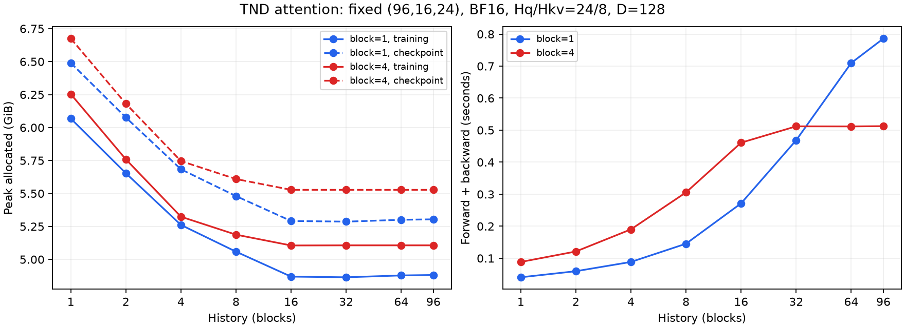

# TND history sensitivity: memory and compute

## Previous comparison settings

The BSA64/TND comparison configured per-sample history uniformly in the inclusive range 1–64 blocks and block size in 1–4 latent frames. Its 15 recorded updates actually sampled histories 2–64. Thus its whole-model peak was not a fixed-history measurement. History counts preceding clean blocks; it is not seconds or raw video frames. The first latent frame is a singleton block, with remaining latent frames grouped by block size.

## Controlled attention experiment

- Ascend 910B3, `cosmos-framework-py312`, BF16, seed 42, Hq/Hkv=24/8, head dimension 128, UND=67.
- Shape `(96,16,24)` comes from the first sample of the prior 480p/30-second-split dataset run. Q=73728 and KV=73795 tokens, identical random Q/K/V and output gradient at every history. This isolates attention and does not decode the dataset again.
- Scan block sizes 1 and 4, histories 1,2,4,8,16,32,64,96. Every geometry uses a fresh process on physical card 0. Two warmup iterations and five measured iterations per mode.
- `training` measures forward and backward; `checkpoint` additionally wraps the attention function in real non-reentrant activation checkpointing. It is an attention-level checkpoint experiment, not a complete transformer block.
- Report peak allocated memory including inputs, upstream gradient, plan indices, output and returned Q/K/V gradients. These are absolute per-process tensor allocation peaks, not incremental attention workspace or whole-model footprints. Timing includes device synchronization; plan construction and data preparation are excluded.
- Allocator cache is emptied between modes. Raw files include reserved memory, baseline allocation, forward-only peaks and live memory after forward.

| Block frames | History blocks | Chunks | F+B peak GiB | Checkpoint peak GiB | F+B seconds | Index MiB |
| ------------ | -------------- | ------ | ------------ | ------------------- | ----------- | --------- |
| 1            | 1              | 2      | 6.0679       | 6.4898              | 0.0405      | 1.78      |
| 1            | 2              | 2      | 5.6533       | 6.0759              | 0.0595      | 2.33      |
| 1            | 4              | 3      | 5.2615       | 5.6834              | 0.0884      | 3.41      |
| 1            | 8              | 5      | 5.0587       | 5.4803              | 0.1453      | 5.51      |
| 1            | 16             | 10     | 4.8696       | 5.2915              | 0.2714      | 9.43      |
| 1            | 32             | 16     | 4.8645       | 5.2864              | 0.4685      | 16.13     |
| 1            | 64             | 26     | 4.8785       | 5.3004              | 0.7098      | 25.04     |
| 1            | 96             | 31     | 4.8817       | 5.3039              | 0.7862      | 27.94     |
| 4            | 1              | 2      | 6.2531       | 6.6750              | 0.0884      | 1.70      |
| 4            | 2              | 2      | 5.7587       | 6.1806              | 0.1211      | 2.22      |
| 4            | 4              | 3      | 5.3237       | 5.7456              | 0.1902      | 3.19      |
| 4            | 8              | 5      | 5.1876       | 5.6095              | 0.3057      | 4.85      |
| 4            | 16             | 7      | 5.1057       | 5.5276              | 0.4609      | 7.06      |
| 4            | 32             | 8      | 5.1067       | 5.5275              | 0.5120      | 7.76      |
| 4            | 64             | 8      | 5.1067       | 5.5275              | 0.5117      | 7.76      |
| 4            | 96             | 8      | 5.1067       | 5.5275              | 0.5125      | 7.76      |



## Interpretation

Memory initially decreases, then stays nearly flat; it does not grow proportionally to history in this fixed-length experiment. Longer history increases arithmetic and total gather volume, so runtime rises until all available history is visible. Block=4 has 25 temporal blocks for T=96 (first latent singleton); history >=24 already covers all preceding blocks, so 32/64/96 have identical plans.

The implementation caps expanded KV per chunk at 131072 tokens. Longer histories admit fewer query groups per chunk: for block=1, history=1 versus 64 changes chunk count from 2 to 26 and maximum query tokens per chunk from 60288 to 9600. This reduces query-side temporaries/workspace, consistent with the observed initial decrease. Backward rebuilds the gathered KV one chunk at a time and accumulates shared gradients in FP32 rather than retaining all expanded KV activations. Detailed operator-by-operator attribution would require a memory trace; this experiment records allocator peaks.

The bound is not absolute: a single group's KV can exceed the configured chunk target, and plan indices still grow with expanded history. Block=1 index storage grows from 1.78 MiB at history=1 to 25.04 MiB at history=64. Fixed-length full Q/K/V, output and FP32 gradient buffers remain. Increasing video length, resolution, batch size or head count can still raise memory materially. Do not interpret the result as unlimited history being free.

## Whole-model endpoint check

Both endpoint runs completed eight updates on four Ascend 910B3 devices (physical 4–7). The final five updates are measured. All eight updates have identical source input metadata and packing metadata except the intended history change; block size is always 1. The single-card sweep overlapped the history=1 run on disjoint devices and finished before history=64 training steps began. This is a single sequential pair, not a repeated-run confidence interval.

| Fixed history | Peak allocated GiB/device | Peak reserved GiB/device | Mean seconds/update |
| ------------- | ------------------------- | ------------------------ | ------------------- |
| 1             | 37.439787                 | 56.298828                | 14.491636           |
| 64            | 37.497431                 | 56.378906                | 35.340231           |

History=1 to 64 increases whole-model peak allocation by 59.03 MiB (0.154%), while iteration time becomes 2.439x as long. Thus the whole-model endpoints show a small upward memory change, not the initial decrease seen in the isolated attention peak. Different components can determine the whole-model high-water mark; isolated attention peaks cannot simply be subtracted from it. Per-step allocation increases are consistently small in all five paired updates. No memory trace was collected to identify the precise component setting that peak.

The practical conclusion is that this implementation keeps fixed-video-length memory approximately flat as history increases, with a small metadata/residency cost, while compute increases substantially. Whole-model intermediate histories were not measured; the 16-case attention sweep supplies the controlled intermediate trend. Do not claim strict monotonicity for the whole model or generalize these endpoint values to longer videos.

Iteration time includes data loading, VAE, model forward/backward and optimizer update, using the slowest rank per update. Memory takes the maximum measured per-device allocation across ranks and updates. Both runs retain full checkpointing. The attention checkpoint microbenchmark uses a different boundary than the whole-model checkpoint configuration and its absolute memory values are not a whole-model prediction.

## Artifacts and reproduction

Branch: `exp/tnd-history-memory-20260916`, based on comparison commit `993b4ef`. Model code is unchanged.

- [Kernel measurements](./tnd_history_memory_20260916_kernels.json)
- [Whole-model measurements and paired steps](./tnd_history_memory_20260916_training.json)
- Raw sweep records: `../cosmos-profile-logs/20260916_tnd_history_sweep` relative to the worktree.

```bash
source tools/ascend_experiment_env.sh
export PYTHONPATH="$PWD${PYTHONPATH:+:$PYTHONPATH}"
ASCEND_RT_VISIBLE_DEVICES=0 python tools/benchmark_tnd_history.py --output /tmp/tnd_history_NEW
RUN_PREFIX=/tmp/tnd_history_training_NEW bash tools/benchmark_tnd_history_training.sh
```

The second command uses four idle physical cards 4–7 by default, the actual `egosuite_demo_v1` dataset, 480p with the prior comparison's bucket overrides, 30-second maximum splits with 2-second overlap, full checkpointing, seed 42, fixed block=1, and histories 1 and 64. Each run has eight updates, first three warmup and final five measured. The script rejects occupied devices and existing output directories.
